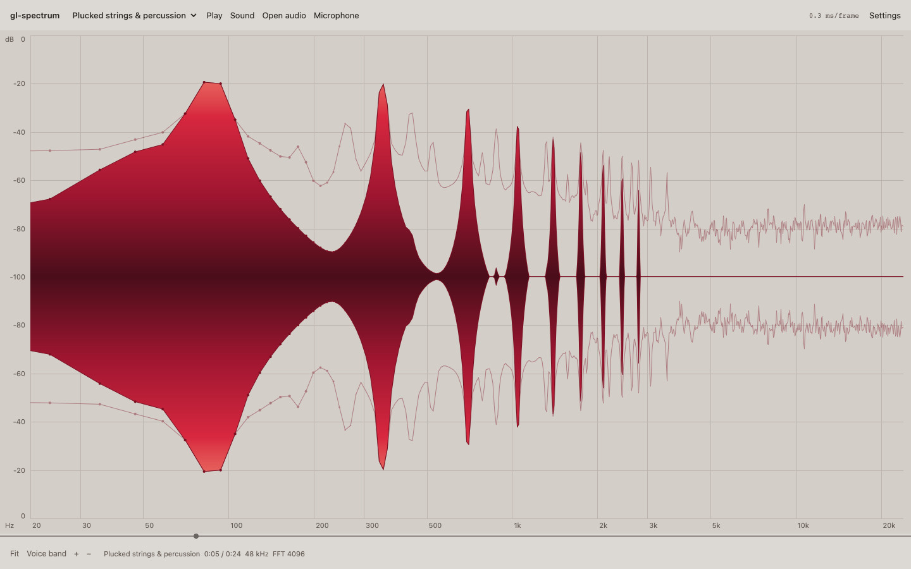

# gl-spectrum

WebGL2 spectrum renderer for audio analysers and editors. Every pixel column shows the loudest of the bins under it, so a one-bin peak among 65536 stays visible at any width; where bins spread apart, an anti-aliased line runs through them, with dots. The fill under the line is colored by level, and can mirror the spectrum about a center line.

[](https://dy.github.io/gl-spectrum/)

[Demo](https://dy.github.io/gl-spectrum/): the v3 page on v4, random palettes and all: Bach's cello, Chopin, Vivaldi, Beethoven, a blackbird, a poem read aloud, live radio, the microphone or your own audio, mirrored, with its trail and weighting. Wheel or pinch zooms frequencies, drag moves them.

## Usage

`npm i gl-spectrum`

```js
import Spectrum from 'gl-spectrum'

// the drawing buffer is yours to size
canvas.width = canvas.clientWidth * devicePixelRatio
canvas.height = canvas.clientHeight * devicePixelRatio

let analyser = audioContext.createAnalyser()
let bins = new Float32Array(analyser.frequencyBinCount)
let sp = new Spectrum(canvas, { data: bins, sampleRate: audioContext.sampleRate })

// the array is referenced: refill it and draw
function frame() {
  analyser.getFloatFrequencyData(bins)
  sp.clear().render()
  requestAnimationFrame(frame)
}
```

Peak hold, as a second spectrum over the first:

```js
let peaks = new Float32Array(bins.length).fill(-Infinity)
let hold = new Spectrum(sp.gl, { data: peaks, sampleRate: audioContext.sampleRate, fill: false, color: '#0006' })

// in frame(), after getFloatFrequencyData: hold the peaks, falling 0.3 dB a frame
for (let k = 0; k < bins.length; k++) peaks[k] = Math.max(bins[k], peaks[k] - .3)
sp.clear().render()
hold.render()
```

The v3 look: `{ align: .5, fill: ['#4a0d1a', '#d8283f', '#f59a87'] }`. Spectrums, [gl-spectrogram](https://github.com/dy/gl-spectrogram) and [gl-waveform](https://github.com/dy/gl-waveform) lanes can share one `WebGL2RenderingContext`.

## API

### `new Spectrum(target, options?)`

`target` is a canvas, whose WebGL2 context is created (`preserveDrawingBuffer: true`, `antialias: false`) or reused, or a `WebGL2RenderingContext` to share. Spectrums on one context share one shader program; each has its own small textures. `options` go to `update()`.

### `sp.update(options)`

Option | Default | Meaning
---|---|---
`data` | empty | Levels in dB, one per bin, bin k at k · sampleRate / (2 · length) Hz, as `AnalyserNode.getFloatFrequencyData` gives. A `Float32Array` is referenced, not copied, and read at each render; other array-likes are converted.
`sampleRate` | `44100` | Hz.
`scale` | `'log'` | Frequency axis: `'log'` (octaves) from 20 Hz, `'mel'`, `'erb'` (equal space per auditory filter, ERB-number 21.4 · log10(1 + 0.00437 f), Glasberg & Moore 1990) or `'lin'` from 0 Hz, to Nyquist.
`band` | whole axis | Visible `[low, high]` in Hz, left to right.
`levels` | `[-100, 0]` | `[floor, top]` in dB.
`align` | `0` | Where the floor sits: `0` the bottom, `1` the top, between a center line the spectrum mirrors to both sides of.
`viewport` | whole canvas | `[x, y, width, height]` in CSS px from the canvas' top-left corner.
`color` | blue | Line: a CSS color, `oklch()` included, or `[r, g, b, a]` in 0..1.
`fill` | `color` at a third | Under the line: a color, or an array of colors as a colormap from the floor to the top; `false` hides it.
`thickness` | `1` | Line width in CSS px, at least one device pixel.
`pixelRatio` | `devicePixelRatio` | Device px per CSS px.

Keys left out keep their value, `null` restores the default.

### Methods

Method | Does
---|---
`sp.render()` | Draws the data as it is now into the viewport, over what is there. Does nothing while the context is lost.
`sp.clear()` | Clears the viewport to transparent.
`sp.pick(x)` | The bin the column at `x` CSS px from the viewport's left shows, the loudest of the bins under it or between bins the nearest: `{ bin, frequency, level }`, or `null` over a gap.
`sp.destroy()` | Releases the textures, the data and the event listeners.

Properties: `sp.gl`, `sp.canvas`, `sp.length` (bins), `sp.band` (Hz), `sp.levels` (dB).

`import { scales } from 'gl-spectrum'`: the axes, for labels that match them. `scales[name].at(f, lo, hi)` is where `f` Hz sits between `lo` and `hi`, 0..1; `.of(u, lo, hi)` is the frequency there; `.low` is the axis' floor. Bin b sits at x = width · `scales[scale].at(b · df, low, high)`, df = sampleRate / 2 / length.

## Rendering

* **Crowded bins**: a device-pixel column with several bins shows the loudest at its center, joined to its neighbours, so a one-bin peak among 65536 reaches its height at full width and noise draws as its upper envelope.
* **Sparse bins**: a bin alone in its column draws where it sits, and a straight line runs to the next, straight in dB and in the axis' units. Dots appear above the floor at bins 6 CSS px apart, at full size at 12. On a log axis the lows are sparse and the highs crowded; both sit side by side without a seam.
* **Levels** past `levels` clamp: `-Infinity` is the floor, `+Infinity` the top. **NaN** is a gap. `pick()` reports levels as given.
* **Fill**: each pixel takes the color of the level at its height. A colormap's stops sit evenly from the floor to the top, interpolated in premultiplied OKLab (Ottosson 2020).
* **Edges**: the floor and the top are inset by half the line width, so the line is whole at both; the floor sits on a pixel center for odd widths, on an edge for even, so silence is crisp.
* **Blending** is premultiplied, over whatever is under the viewport. The context must have `premultipliedAlpha` (the default).
* **Context loss**: nothing throws while the context is lost; on restore, each spectrum that had rendered redraws.

## Architecture

1. Each render reads the data in one pass over the bins in the band and a few pixels beyond, in doubles: the bins of a column become one vertex at its center holding the loudest, a bin alone one vertex where it sits. At most one vertex per device-pixel column.
2. The vertices go into an RGBA32F texture as `[x, level, dot radius, gap]` in viewport pixels, followed by an index of the last vertex left of each column's center: tens of KB.
3. One draw per viewport: a quad whose fragment shader takes its column's vertex from the index, measures the distance to the segments and dots within reach on each drawn side, and fills between the sides up to the line at its x, colored from a 256-texel table.

v3 drew the bins as a WebGL1 triangle or line strip, smoothed and weighted them in the component, and drew its grid with plot-grid.

### Measured

`npm run bench`: headless Chromium 153 on an Apple M4 Max (Metal) with other jobs running (load average ~10), one view of 1440×400 CSS px at DPR 2 (2880×800 device px), log axis, mirrored, colormap fill, new levels written into the data array every frame. CPU is the `render()` call; GPU time is from `EXT_disjoint_timer_query_webgl2` (`gl.finish()` returns before the GPU is done in Chrome on Metal). Mean / p95 of 300 frames.

Bins | Whole axis, CPU | Whole axis, GPU | 2–2.5 kHz, CPU | 2–2.5 kHz, GPU
---|---|---|---|---
1024 | 0.04 / 0.1 ms | 1.6 / 3.6 ms | 0.01 / 0.1 ms | 1.1 / 2.2 ms
16384 | 0.28 / 0.4 ms | 0.56 / 1.0 ms | 0.02 / 0.1 ms | 0.27 / 0.45 ms
65536 | 0.89 / 1.0 ms | 0.80 / 1.6 ms | 0.05 / 0.1 ms | 0.70 / 1.5 ms

## Changes from v3

* ESM with a default export, WebGL2, no dependencies. Was CommonJS with gl-util, plot-grid, color-interpolate, canvas-loop and 11 more packages, and a 2D canvas version.
* Draws on a given canvas or context when `render()` is called. Was `Spectrum({ container, canvas, context, autostart })` with its own canvas and render loop.
* `update({ data })` takes dB per bin and references a `Float32Array`. Was `set(magnitudes)`, copied.
* Draws the loudest bin per pixel column and a line through sparse bins, with dots, on log, mel, erb or linear axes.
* `band`, `levels`, `scale` and `fill` replace `minFrequency`/`maxFrequency`, `minDb`/`maxDb`, `log` and `palette`. `align` stays.
* Added: `pick()`, `scales`, `viewport`, `thickness`, `pixelRatio`, context loss handling.
* Removed, with replacements where one exists:
  * `trail`: a second spectrum over your running maximum, as in Usage.
  * `smoothing`: `AnalyserNode.smoothingTimeConstant`, or average the data yourself.
  * `weighting`: apply it to the data, e.g. with [a-weighting](https://github.com/audiojs/a-weighting).
  * `grid`: draw one under or over the canvas.
  * `type: 'bar'`, `barWidth`, `balance`, `interactions`, `background`, `autostart`; the `data` and `update` events; the `magnitudes` and `peak` properties.

## Develop

* `npm test`: every pixel column's bin against brute force over the bins (log, mel, erb and lin axes; whole, zoomed and past-Nyquist bands; 1 to 65539 bins; NaN runs, ±Infinity; DPR 1 to 2, offset viewports), pixel checks through `readPixels` (a one-bin peak among 65536, the line and dots, align, colormap and default fill, transparency, gaps, lanes, data refilled in place, resize, colors), context loss, the API contract and the demo. Headless Chromium through Playwright; `npx playwright install chromium` if it is missing.
* `npm run bench`: the table above.
* Demo: any static server at the repo root, e.g. `npx serve`, then open `/`. `?source=blackbird` picks a recording, `wqxr` the radio, `mic` the microphone.

## License

© 2016 Dmitry Yv. MIT License
